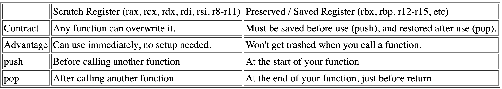

### 사전준비
1. `brew install nasm`


### 어셈블리 기본규칙
1. 대소문자 구분이 없다
2. 줄바꿈으로 명령어를 구분한다(`;`는 주석)
	`mov rcx, 5; mov rax, 3; Whoops!`
3. 한 줄에 하나의 명령어만 작성한다
4. 변수 대신 CPU안의 저장소인 레지스터를 활용한다.

### 어셈블리에서의 산술
```c
int a = 3;
int c = 7;
a += c;
return a // c언어에서의 덧셈
```

```nasm
mov rax, 3
mov rcx, 7
add rax, rcx
ret ; 어셈블리에서의 덧셈
```

### 어셈블리에서의 조건문
#### Jump
- CPU에게 다음의 실행될 코드를 지정해준다. C/C++의 `goto`와 같은 기능을 함.
```nasm
; assembly jump

	mov rax,3
	jmp derp
	mov rax,999 ; not executed!
derp:
	ret
```
```C
// C or C++ goto

	int x=3;
	goto derp;
	x=999; // not executed!
derp:
	return x;
```
#### Conditional Jump
어셈블리에선, `cmp`등 비교 명령어들을 통한 분기를 생성할 수 있고, 이 결과를 통한 여러 __조건부 점프(Conditional Jump)__ 를 진행할 수 있다.
- `cmp`등의 비교 명령어(내부적으론 두 값의 차를 활용)
- `je(jump-if-equal)`등의 조건부 점프 명령어, 조건이 충족되면 jump를 수행한다.

```nasm
; compare and jump-if-equl("je")
	mov rax,3
	cmp rax,3 ; compare rax with 3..
	je lemme_outta_here ; if it's equal, then jump
	mov rax,999 ; not executed *if* we jump

lemme_outta_here:
	ret
```

```nasm
; compare and jump-if-less-than("jl")
	mov rax,1
	cmp rax,3 ; compare rax with 3..
	jl lemme_outta_here ; if it's less, then jump
	mov rax,999 ; not executed *if* we jump

lemme_outta_here:
	ret
```

### 어셈블리어에서의 반복문
어셈블리어에서 특정한 코드를 반복수행하려면, jump를 활용하여 이어질 실행 흐름을 원하는 코드의 부분으로 보내면 된다. 이때 적절한 조건을 사용하여 의도하지 않은 무한루프의 가능성을 없애야 한다.

아래는 동일한 기능을 하는 함수를 어셈블리어와 C로 나타낸 것이다.

```nasm
; rdi is our first functioin argument
mov rax,0 ; sum added here

start:	; loop begins here
	add rax, 10 ; add each time around the loop

	sub rdi,1 ; loop increment
	cmp rdi,0 ; loop test
	jg start ; continue loop if rdi>0

ret
```
```C
int foo(int bar) {
	int sum = 0;
	for (int count=bar; count > 0; count--)
		sum += 10;
	return sum;
}
```
### 스택(Stack): Push 그리고 Pop
스택은 자주 넣고 꺼낼 수 있는 __임시 저장소(temporary storage)__ 역할을 하게끔 설계되었다. 스택은 주로 다른 함수를 호출하기 전 기존의 값이 필요하면 이를 저장하는 공간으로 활용된다(scratch 레지스터의 경우, 함수 호출 이후에 해당 레지스터의 데이터값이 그대로일거라는 보장이 불가능하기 때문).
> 레지스터는 CPU 내부에 위치해있고, 스택은 메인 메모리(RAM)의 일부를 사용한다.
레지스터는 속도가 매우 빠른 대신 공간이 매우 제한적이고, 스택은 속도가 레지스터에 비해 느리지만 용량이 크다
그렇기 때문에, 레지스터는 가장 자주 사용되는 변수나 계산 중간값을 저장하는 용도로, 스택은 함수 호출 시 리턴 주소, 매개변수, 지역 변수 등을 저장하는 백 스토어("back store")역할에 적합하다

- Push: 레지스터의 상수 또는 값을 스택에 저장한다.
	- `push 3`
	- `push rax`
- Pop: 스택의 가장 상위의 값을 스택에서 레지스터로 옮겨온다.
	- `pop rax`
	- `pop rdi`

스택은 __후입선출__ 자료구조이다. 꼭 명심하고 코드를 작성하자

#### 레지스터 값을 스택에 저장하기
__레지스터 유형(scratch, preserved)__
1. __scratch__ 레지스터(__caller-saved__ 레지스터)
	- 호출자(__caller__)가 함수 호출 전에 이 레지스터의 값이 함수 호출 이후에도 필요하다면 스택 등에 따로 백업해아 함.
	- 피호출자(__callee__)는 함수 내에서 자유롭게 해당 레지스터를 덮어쓸 수 있으며, __함수 종료시 복원하지 않아도 된다__.

2. __preserved__ 레지스터(__callee-saved__ 레지스터)
	- 피호출자 함수(__callee__)가 해당 레지스터를 사용하기 전에 값을 스택에 저장하고, __함수 종료 시 복원__ 해야 하는 레지스터 종류
	- 호출자(__caller__) 입장에서는 이 __레지스터에 저장된 값이 함수 호출 전후 변하지 않는다__ 고 가정할 수 있다.


Push와 Pop을 활용하여 함수의 시작과 끝에서 레지스터의 값을 저장할 수 있다.

```nasm
; preserved register인 "rbx" 값을 저장하고 불러온다
push rbx ; save old copy of this register

mov rbx,23
mov rax,rbx

pop rbx ; restore main's copy from the stack
ret
```

### 어셈블리어에서의 함수 호출
_들어가기 전에.._
#### Calling Convention??
함수가 호출되고 반환되는 과정에서 __매개변수 전달__, __반환값 처리__, __스택 정리 방식__ 을 정의하는 규칙. 함수 호출 과정에서 호출자(caller)와 피호출자(callee)가 서로 어떻게 데이터를 교환하고 협력할지에 대한 표준을 제공한다.

- `rax` 는 반환값 레지스터이다
- `rcx`과 `rdx`는 임시 값들을 저장할 수 있는 __"scratch"__ 레지스터이다
- `rdi`는 첫번째 매개변수이다
- `rsi`는 두번째 매개변수이다

__RSP(스택 포인터)__: x86-64 아키텍처에서 현재 스택의 가장 위를 가리키는 레지스터이다.

__RSP의 역할__
1. 스택의 최상단 주소 관리
RSP 레지스터는 항상 스택의 최상단(가장 최근에 푸시된 데이터가 있는 위치)를 가리킨다.
2. 함수 호출과 반환 과정 지원
함수를 호출(`call`)하면 현재 명령어 다음 주소(리턴 주소)가 스택에 저장되고, 함수가 종료(`ret`)되면 스택에 저장된 리턴 주소를 RSP를 통해 가져와 원래 실행 위치로 복귀합니다.
3. 로컬 변수 및 임시 데이터 저장
함수 내에서 필요한 지역 변수를 스택에 할당할 때 RSP를 기준으로 메모리 공간을 확보합니다.
예) `sub rsp, 32`를 통해 스택에 32바이트 공간을 확보하고, 해당 영역에 로컬 변수를 저장할 수 있다.
4. 호출 규약(Call Convention)준수
x86-64의 System V ABI나 Windows x64 ABI 모두 함수 호출 시 스택 정렬 상태(16바이트 정렬)를 요구한다. RSP를 적절히 조정하여 함수 호출 전후로 16바이트 정렬 상태를 유지해야 한다.
---

`call` 명령어를 사용하여 함수를 호출할 수 있다. 호출된 함수는 `ret`을 활용하여 값을 반환할 수 있다.
함수 호출을 하게 되면, 기본적으로 어셈블러는 호출된 함수가 파일 뒷부분에 정의되었다고 간주한다. `exit` 등 외부에서 정의된 변수나 함수를 현재 파일에서 사용하려면, `extern`키워드를 사용하여 선언해야 한다.

```nasm
; calling UNIX function "exit"
extern exit ; tell assembler function is
defined elsewhere
call exit ; call the function

; calling standard C library function "getchar"
extern getchar
call getchar
ret
```

__`call`로 함수를 호출할때 _stack Alignment_ 을 만족시키기 위해 홀수번의 `push`가 필수적이다!__
#### Stack Alignment?
__x86-64 ABI__ 에 따르면, 성능 최적화와 일부 CPU명령어의 요구사항을 맞추기 위해서, 함수 호출 전에 __스택 포인터(RSP)는 16바이트로 정렬__ 시켜야 한다.
> __ABI?__
_ABI(Application Binary Interface)_ 는 응용 프로그램 이진 인터페이스로, 이진 형태(컴파일 완료된 기계어 코드)에서 상호 운용성을 보장하기 위한 규칙과 표준을 의미한다.
즉 프로그램이 컴파일되어 실행 파일이나 라이브러리가 되었을 때, 서로 다른 모듈(다른 언어로 작성된 코드, 다른 컴파일러로 빌드된 라이브러리)간에 어떻게 상호 작용하고 데이터를 교환할지에 대한 약속.
API가 소스 코드 레벨에서의 호환성을 책임진다면, ABI는 바이너리 레벨에서의 호환성을 책임진다고 생각하면 편하다

- 스택 정렬의 기본 규칙
	1. x86-64 ABI에 따르면 시스템 호출 및 C 표준 라이브러리 함수는 스택 포인터(RSP)가 16바이트로 정렬된 상태에서 호출되어야 한다.
	2. 하지만 `call`은 스택에 8바이트(리턴 주소)를 `push`한다. 따라서, 호출 직후의 스택 포인터는 16바이트 정렬상태에서 8바이트 어긋난 상태가 된다.
		- 그렇게 되면 오류 발생의 위험이 존재한다.
	3. 그렇기 때문에 함수 호출 전에 __홀수 번의 `push`(8바이트)__ 를 수행하면 스택 포인터는 다시 16바이트로 정렬된다!

```nasm
; 예시코드
section .data
    msg db "Hello, World!", 0  ; Null-terminated string

section .text
    global _start
    extern printf              ; C 표준 라이브러리 printf 함수

_start:
    ; 스택 정렬 확인
    push rdx                   ; 홀수 번의 push로 스택 정렬 (임시로 rdx 사용)

    ; printf 호출
    lea rdi, [rel msg]         ; 첫 번째 매개변수: 문자열 주소
    xor rax, rax               ; rax = 0 (printf는 가변 인자를 사용하므로 초기화)
    call printf                ; printf 호출

    ; 스택 복구
    pop rdx                    ; push로 사용한 rdx 복원

    ; 종료
    mov rax, 60                ; exit syscall
    xor rdi, rdi               ; exit code 0
    syscall
```


> __Stack Frame?__
_스택 프레임(Staack Frame)_ 은 함수가 호출될 때마다 함수의 실행 환경(매개변수, 지역 변수, 반환 주소 등)을 저장하기 위해 스택 위에 형성되는 메모리 영역. 함수가 호출될 대마다 새로운 스택 프레임이 할당되고, 함수가 종료되면 해당 스택 프레임은 정리되면 이전 함수의 스택 프레임으로 되돌아가는 구조를 형성한다.
이를 통해 함수의 독립적인 실행 환경을 보장하고, 함수 간에 데이터와 제어 흐름을 안전하게 관리할 수 있다.
RBP(Base Pointer)레지스터는 함수가 실행될 때 해당 함수의 스텍 프레임을 기준점으로 삼는 레지스터이다.
