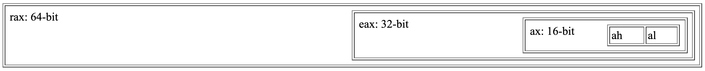

### 사전준비
1. `brew install nasm`


### 어셈블리 기본규칙
1. 대소문자 구분이 없다
2. 줄바꿈으로 명령어를 구분한다(`;`는 주석)
	`mov rcx, 5; mov rax, 3 는 mov 부터 주석처리..`
3. 한 줄에 하나의 명령어만 작성한다
4. 변수 대신 CPU안의 저장소인 레지스터를 활용한다.

### 어셈블리에서의 산술
```c
int a = 3;
int c = 7;
a += c;
return a // c언어에서의 덧셈
```

```nasm
mov rax, 3
mov rcx, 7
add rax, rcx ; rax 레지스터의 값 + rcx 레지스터의 값을 더한 뒤 rax에 저장
ret ; 어셈블리에서의 덧셈
```

### 어셈블리에서의 조건문
#### Jump
- CPU에게 다음의 실행될 코드를 지정해준다. C/C++의 `goto`와 같은 기능을 함.
```nasm
; assembly jump

	mov rax,3
	jmp derp
	mov rax,999 ; not executed!
derp:	ret
```
```C
// C or C++ goto

	int x=3;
	goto derp;
	x=999; // not executed!
derp:
	return x;
```
#### Conditional Jump
어셈블리에선, `cmp`등 비교 명령어들을 통한 분기를 생성할 수 있고, 이 결과를 통한 여러 __조건부 점프(Conditional Jump)__ 를 진행할 수 있다.
- `cmp`등의 비교 명령어(내부적으론 두 값의 차를 활용)
- `je(jump-if-equal)`등의 조건부 점프 명령어, 조건이 충족되면 jump를 수행한다.

```nasm
; compare and jump-if-equl("je")
	mov rax,3
	cmp rax,3 ; compare rax with 3..
	je lemme_outta_here ; if it's equal, then jump
	mov rax,999 ; not executed *if* we jump

lemme_outta_here:	ret
```

```nasm
; compare and jump-if-less-than("jl")
	mov rax,1
	cmp rax,3 ; compare rax with 3..
	jl lemme_outta_here ; if rax's data is less than 3, then jump
	mov rax,999 ; not executed *if* we jump

lemme_outta_here:	ret
```

### 어셈블리어에서의 반복문
어셈블리어에서 특정한 코드를 반복수행하려면, jump를 활용하여 이어질 실행 흐름을 원하는 코드의 부분으로 보내면 된다. 이때 적절한 조건을 사용하여 의도하지 않은 무한루프의 가능성을 없애야 한다.

아래는 동일한 기능을 하는 함수를 어셈블리어와 C로 나타낸 것이다.

```nasm
; rdi is our first functioin argument
mov rax,0 ; sum added here

start:	; loop begins here
	add rax, 10 ; add each time around the loop

	sub rdi,1 ; loop increment
	cmp rdi,0 ; loop test
	jg start ; continue loop if rdi>0

ret
```
```C
int foo(int bar) {
	int sum = 0;
	for (int count=bar; count > 0; count--)
		sum += 10;
	return sum;
}
```
### 스택(Stack): Push 그리고 Pop
스택은 자주 넣고 꺼낼 수 있는 __임시 저장소(temporary storage)__ 역할을 하게끔 설계되었다. 스택은 주로 다른 함수를 호출하기 전 기존의 값이 필요하면 이를 저장하는 공간으로 활용된다(scratch 레지스터의 경우, 함수 호출 이후에 해당 레지스터의 데이터값이 그대로일거라는 보장이 불가능하기 때문).
> 레지스터는 CPU 내부에 위치해있고, 스택은 메인 메모리(RAM)의 일부를 사용한다.
레지스터는 속도가 매우 빠른 대신 공간이 매우 제한적이고, 스택은 속도가 레지스터에 비해 느리지만 용량이 크다
그렇기 때문에, 레지스터는 가장 자주 사용되는 변수나 계산 중간값을 저장하는 용도로, 스택은 함수 호출 시 리턴 주소, 매개변수, 지역 변수 등을 저장하는 백 스토어("back store")역할에 적합하다

- Push: 레지스터의 상수 또는 값을 스택에 저장한다.
	- `push 3`
	- `push rax`
- Pop: 스택의 가장 상위의 값을 스택에서 레지스터로 옮겨온다.
	- `pop rax`
	- `pop rdi`

스택은 __후입선출__ 자료구조이다. 꼭 명심하고 코드를 작성하자

#### 레지스터 값을 스택에 저장하기
__레지스터 유형(scratch, preserved)__
1. __scratch__ 레지스터(__caller-saved__ 레지스터)
	- 호출자(__caller__)가 함수 호출 전에 이 레지스터의 값이 함수 호출 이후에도 필요하다면 스택 등에 따로 백업해아 함.
	- 피호출자(__callee__)는 함수 내에서 자유롭게 해당 레지스터를 덮어쓸 수 있으며, __함수 종료시 복원하지 않아도 된다__.

2. __preserved__ 레지스터(__callee-saved__ 레지스터)
	- 피호출자 함수(__callee__)가 해당 레지스터를 사용하기 전에 값을 스택에 저장하고, __함수 종료 시 복원__ 해야 하는 레지스터 종류
	- 호출자(__caller__) 입장에서는 이 __레지스터에 저장된 값이 함수 호출 전후 변하지 않는다__ 고 가정할 수 있다.


Push와 Pop을 활용하여 함수의 시작과 끝에서 레지스터의 값을 저장할 수 있다.

```nasm
; preserved register인 "rbx" 값을 저장하고 불러온다
push rbx ; save old copy of this register

mov rbx,23
mov rax,rbx

pop rbx ; restore main's copy from the stack
ret
```

### 어셈블리어에서의 함수 호출
_들어가기 전에.._
#### Calling Convention??
함수가 호출되고 반환되는 과정에서 __매개변수 전달__, __반환값 처리__, __스택 정리 방식__ 을 정의하는 규칙. 함수 호출 과정에서 호출자(caller)와 피호출자(callee)가 서로 어떻게 데이터를 교환하고 협력할지에 대한 표준을 제공한다.

- `rax` 는 반환값 레지스터이다
- `rcx`과 `rdx`는 임시 값들을 저장할 수 있는 __"scratch"__ 레지스터이다
- `rdi`는 첫번째 매개변수이다
- `rsi`는 두번째 매개변수이다

__RSP(스택 포인터)__: x86-64 아키텍처에서 현재 스택의 가장 위를 가리키는 레지스터이다.

__RSP의 역할__
1. 스택의 최상단 주소 관리
RSP 레지스터는 항상 스택의 최상단(가장 최근에 푸시된 데이터가 있는 위치)를 가리킨다.
2. 함수 호출과 반환 과정 지원
함수를 호출(`call`)하면 현재 명령어 다음 주소(리턴 주소)가 스택에 저장되고, 함수가 종료(`ret`)되면 스택에 저장된 리턴 주소를 RSP를 통해 가져와 원래 실행 위치로 복귀합니다.
3. 로컬 변수 및 임시 데이터 저장
함수 내에서 필요한 지역 변수를 스택에 할당할 때 RSP를 기준으로 메모리 공간을 확보합니다.
예) `sub rsp, 32`를 통해 스택에 32바이트 공간을 확보하고, 해당 영역에 로컬 변수를 저장할 수 있다.
4. 호출 규약(Call Convention)준수
x86-64의 System V ABI나 Windows x64 ABI 모두 함수 호출 시 스택 정렬 상태(16바이트 정렬)를 요구한다. RSP를 적절히 조정하여 함수 호출 전후로 16바이트 정렬 상태를 유지해야 한다.
---

`call` 명령어를 사용하여 함수를 호출할 수 있다. 호출된 함수는 `ret`을 활용하여 값을 반환할 수 있다.
함수 호출을 하게 되면, 기본적으로 어셈블러는 호출된 함수가 파일 뒷부분에 정의되었다고 간주한다. `exit` 등 외부에서 정의된 변수나 함수를 현재 파일에서 사용하려면, `extern`키워드(_의사 명령어, Pseudo-Instruction_)를 사용하여 선언해야 한다.

```nasm
; calling UNIX function "exit"
extern exit ; tell assembler function is
defined elsewhere
call exit ; call the function

; calling standard C library function "getchar"
extern getchar
call getchar
ret
```

__`call`로 함수를 호출할때 _stack Alignment_ 을 만족시키기 위해 홀수번의 `push`가 필수적이다!__
#### Stack Alignment?
__x86-64 ABI__ 에 따르면, 성능 최적화와 일부 CPU명령어의 요구사항을 맞추기 위해서, 함수 호출 전에 __스택 포인터(RSP)는 16바이트로 정렬__ 시켜야 한다.
> __ABI?__
_ABI(Application Binary Interface)_ 는 응용 프로그램 이진 인터페이스로, 이진 형태(컴파일 완료된 기계어 코드)에서 상호 운용성을 보장하기 위한 규칙과 표준을 의미한다.
즉 프로그램이 컴파일되어 실행 파일이나 라이브러리가 되었을 때, 서로 다른 모듈(다른 언어로 작성된 코드, 다른 컴파일러로 빌드된 라이브러리)간에 어떻게 상호 작용하고 데이터를 교환할지에 대한 약속.
API가 소스 코드 레벨에서의 호환성을 책임진다면, ABI는 바이너리 레벨에서의 호환성을 책임진다고 생각하면 편하다

- 스택 정렬의 기본 규칙
	1. x86-64 ABI에 따르면 시스템 호출 및 C 표준 라이브러리 함수는 스택 포인터(RSP)가 16바이트로 정렬된 상태에서 호출되어야 한다.
	2. 하지만 `call`은 스택에 8바이트(리턴 주소)를 `push`한다. 따라서, 호출 직후의 스택 포인터는 16바이트 정렬상태에서 8바이트 어긋난 상태가 된다.
		- 그렇게 되면 오류 발생의 위험이 존재한다.
	3. 그렇기 때문에 함수 호출 전에 __홀수 번의 `push`(8바이트)__ 를 수행하면 스택 포인터는 다시 16바이트로 정렬된다!

```nasm
; 예시코드
section .data
    msg db "Hello, World!", 0  ; Null-terminated string

section .text
    global _start
    extern printf              ; C 표준 라이브러리 printf 함수

_start:    ; 스택 정렬 확인
    push rdx                   ; 홀수 번의 push로 스택 정렬 (임시로 rdx 사용)

    ; printf 호출
    lea rdi, [rel msg]         ; 첫 번째 매개변수: 문자열 주소
    xor rax, rax               ; rax = 0 (printf는 가변 인자를 사용하므로 초기화)
    call printf                ; printf 호출

    ; 스택 복구
    pop rdx                    ; push로 사용한 rdx 복원

    ; 종료
    mov rax, 60                ; exit syscall
    xor rdi, rdi               ; exit code 0
    syscall
```


#### Stack Frame? Prologue & Epilogue?
__스택 프레임(Stack Frame)__ 은 함수가 호출될 때마다 함수의 실행 환경(매개변수, 지역 변수, 반환 주소 등)을 저장하기 위해 스택 위에 형성되는 메모리 영역이다. 함수가 호출될 대마다 새로운 스택 프레임이 할당되고, 함수가 종료되면 해당 스택 프레임은 정리되며 이전 함수(caller)의 스택 프레임으로 되돌아가는 구조를 형성한다.
이를 통해 함수의 독립적인 실행 환경을 보장하고, 함수 간에 데이터와 제어 흐름을 안전하게 관리할 수 있다.
RBP(Base Pointer)레지스터는 함수가 실행될 때 해당 함수의 스텍 프레임을 기준점으로 삼는 레지스터이다.

__프롤로그(Prologue), 에필로그(Epilogue)__: 함수가 시작할 때와 끝날 때 수행하는 일정한 패턴의 코드
- __프롤로그(함수가 시작할 때)__
	1. 이전 함수의 베이스 포인터(RBP) 저장
	함수는 스택 프레임을 추적하기 위해 `rbp`레지스터를 활용하는데, 프롤로그에서 현재의 rbp(호출자 함수의 rbp)를 스택에 `push`해서 나중에 복원할 수 있게 한다.
	2. 새로운 스택 프레임 생성
	`mov rbp, rsp`명령으로 현재 스택 포인터 rsp를 rbp에 복사해서 새로운 기준점을 잡아준다. 이렇게 하면 `rbp`를 기준으로 지역 변수나 인자에 쉽게 접근할 수 있다.
	3. 지역 변수 공간 확보
	함수 내에 필요한 지역 변수가 있다면 `sub rsp, <필요한 크기>`로 스택을 아래로 내려서 메모리를 확보. 이 공간에 지역 변수를 저장할 수 있다.

- __에필로그(함수가 끝날 때)__
	1. 지역 변수 공간 반환
	`add rsp, <확보했던 크기>`를 해서 스택을 원래 자리로 돌려놓는다.
	2. 이전 베이스 포인터 복원
	`pop rbp`를 해서 처음에 프롤로그에서 저장해둔 이전 함수의 `rbp`값을 꺼내서 복원. 이를 통해 스택 상태는 함수 호출 전과 거의 동일해짐
	3. `ret`로 함수 종료
	`ret`명령어를 통해 스택 상에 저장되어 있던 리턴 주소로 돌아가며 함수가 끝난다.

### 어셈블리어에서의 함수 정의
어셈에서의 함수 정의는 `jmp`와 비슷하다, 근데 `ret`을 곁들인..
```nasm
mov rdi,7 ; pass a function parameter
call otherFunction  ; run the function below, until it does "ret"
add rax,1 ; modify returned value
ret

otherFunction: ; a function "declaration" in assembly
	mov rax,rdi ; return our function's only argument
	ret
```
이 코드에선, `call otherFunction`을 통해 otherFunction의 리턴값을 받고, 이를 +1 하여 최종적으로 반환한다. 만약 `call`대신 `jmp`를 넣었다면 `add rax,1` 과 `ret` 는 스킵되어 실행되지 않고, 대신 otherFunction의 리턴값이 최종 반환값이 될 것이다.

#### `global`키워드(의사 명령어)를 통해 작성한 함수를 외부 파일에서도 사용하게 하기
기본적으로 어셈블리에서 정의한 심볼(함수명)은 로컬 범위에 한정되어 있기 때문에, 키워드 `global`을 통해 외부에 공개하고, 외부 파일에선 `extern`을 통해 타겟 함수를 불러와야 한다.

### 레지스터 크기와 오버플로우
보통 한 자료형이 가질 수 있는 값의 범위보다 큰 값이 들어올 경우, __오버플로우__ 가 발생하고, 범위 바깥의 비트들은 무시된다.
```C
int big=1024*1024*1024;
return big*4; // 오버플로우 발생!! 0이 반환된다.
```

어셈블리에선 `jo`(jump if overflow)로 오버플로우 발생 여부를 확인할 수 있다!
```nasm
mov edi,1 ; loop variable
mov eax,0 ; counter

start:	add eax,1 ; increment bit counter

	add edi,edi ; add variable to itself
	jo noes ; check for overflow in the above add

	cmp edi,0
	jne start

ret

noes: ; called for overflow
	mov eax,999
	ret
```

#### 어셈블리 레지스터 크기
다양한 자료형처럼, 레지스터들도 크기별로 존재한다
- rax: 64bit `long`자료형 크기의 레지스터
- eax: 32bit `int`자료형 크기의 레지스터
- ax: 16bit `short`자료형 크기의 레지스터
- al: 8bit `char`자료형 크기의 레지스터
	- ah: al과 같은 크기의 레지스터, ax의 상위 8비트

```nasm
mov rcx,0xf00d00d2beefc03; load a big 64-bit constant
mov eax,ecx; pull out low 32 bits (0x2beefc03)
ret
```


### 메모리와 포인터
예시 코드를 보자..
```nasm
mov rax, rsp ; return the address of the top of the stack
ret

; [주솟값]: 해당 주소에 있는 데이터값을 반환
mov rax, [rsp] ; load the value on top of the stack
ret
```
#### 어셈블리어에서의 라벨링(labeling)
```nasm
bar:	dq 3; dq stands for "Data Quadword", 64 bit constant
foo:	mov rax,bar ; load the address of the 3
	mov rax,[bar] ; load the value 3 from the memory
```

도대체 `dq`가 뭐지??? 검색해보았더니..

#### 의사 명령어(Pseudo-Instructions)??
의사 명령어(Pseudo-Instructions), 즉 실제 x86의 명령어는 아니지만(기계어로 변환되지 않음) 사용의 용이성을 위해 명령어 필드에 두고 사용되는 키워드들로, 어셈블러가 코드 생성 과정에서 사용하는 메타 정보나 데이터 정의용으로 사용된다.
- 데이터 정의
`db`, `dw`, `dd`, `dq` 등으로 데이터 섹션에 정해진 크기의 정수나 문자열을 선언할 수 있다.
- 심볼 관리
`global`, `extern` 등으로 심볼(함수명, 변수명)의 가시성을 제어할 수 있다.
- 섹션 관리
`section .text`, `section .data` 등으로 코드나 데이터가 들어갈 섹션을 지정할 수 있다.
- 정렬, 매크로, 조건부 어셈블
`align`, `%define`, `%ifdef` 같은 것들로 어셈블리 코드 구조를 유연하게 작성할 수 있다.
```nasm
;예시 코드
section .data
    msg db "Hello, World!",0  ; pseudo-instruction 중 하나인 'db'. 문자열(바이트 배열) 정의
    num dq 1234567890123456   ; pseudo-instruction 중 하나인 'dq'. 64비트 정수 정의

section .text
    global _start
_start:    ; 실제 CPU 명령어 (기계어로 변환됨)
    mov rax,1        ; write syscall 번호
    mov rdi,1        ; stdout
    mov rsi,msg       ; msg 주소
    mov rdx,13       ; 길이
    syscall

    mov rax,60       ; exit syscall
    xor rdi,rdi
    syscall
```
더 많은 정보는: [NASM 공식문서](https://www.nasm.us/xdoc/2.16.03/html/nasmdoc3.html)

### 어셈블리어에서의 문자열
먼저 C에서의 문자열 출력 코드를 살펴보자
```C
const char *theString="Yo!";
puts(theString);
```
C컴파일러는 내부적으로 이 코드를..
- 문자열을 위한 메모리 공간을 마련하고, 마련된 공간에 `Y`, `o`, `!` 그리고 문자열의 끝을 알리는 특수문자인 `nul`을 집어넣는다
- theString 포인터에게 마련된 메모리 주소를 가리키도록 한다

어셈블리에서는..
- 메모리 공간을 의사 명령어 `db`(Data byte)를 통해 마련하고, 그곳에 문자열을 할당한다.
	- C와 다르게 '', "", \`\` 전부 사용가능하지만 `\n`같은 문자는 \`\` 에서만 사용가능하다
- 직접 널문자를 `0`을 뒤에 작성함으로서 추가한다.
- jump label을 통해 해당 주소를 가리킨다

```nasm
mov rdi, theString ; rdi points to our string
extern puts  ; declare the function
call puts    ; call it
ret

theString:	; label, just like for jumping
	db `Yo!`,0  ; data bytes for string (don't forget nul!)
```
---
##### `db`는 1byte인줄 알았는데 어케 "Yo!\0"를 전부 저장해?!
`db`는 한 번에 하나의 바이트만 정의하는 것이 아니라, **여러 바이트를 나열하여 한 줄에 정의**할 수 있는 의사 명령어입니다. 즉, `db "Yo!",0`라고 쓰면 `"Y"`, `"o"`, `"!"`, 그리고 `0`(널 종단자) 이 네 개의 바이트를 순서대로 메모리에 배치하게 됩니다.

__왜 가능한가?__
- `db`(define byte) 지시어는 뒤에 오는 값을 모두 바이트 단위로 나열해 메모리에 할당합니다.
- 문자열 리터럴 `"Yo!"`는 `'Y' (0x59)`, `'o' (0x6F)`, `'!' (0x21)` 이렇게 3바이트이며, 마지막에 `0`을 추가해 총 4바이트가 됩니다.
- 예를 들어:
  ```asm
  db 'Y','o','!',0
  ```
  와 같은 형태로 해석되며, 각각의 문자가 1바이트씩 총 4바이트를 차지하게 됩니다.

__정리__
- `db`는 1바이트 단위로 데이터를 정의하는 의사 명령어지만, 여러 인수를 쉼표로 구분하거나 문자열을 사용하면 여러 개의 바이트를 연속해서 정의할 수 있습니다.
- `"Yo!"`는 세 개의 바이트, 마지막의 `0`은 널 종단자(1바이트), 총 4바이트가 `db` 명령을 통해 연속해서 메모리에 저장됩니다.


#### 주소 산술
스택에서와 반대로, 주솟값에 더하기 연산을 통해 다음 데이터셋의 값에 접근할 수 있다
```nasm
dos_equis:	dq 5   ; writes this constant into a "Data Qword" (8 byte block)
	dq 13  ; writes another constant, at [dos_equis+8] (bytes)

foo:	mov rax, [dos_equis] ; read memory at this label
	ret ; return value will be 5
```
```nasm
dos_equis:	dq 5   ; writes this constant into a "Data Qword" (8 byte block)
	dq 13  ; writes another constant, at [dos_equis+8] (bytes)

foo:	mov rax, [dos_equis+8] ; read memory at this label, plus 8 bytes
	ret ; return value will be 13
```
만약 0보다 크고 8보다 작은 값을 주소에 더하게 되면, 5를 표현하는 비트의 일부와 13을 표현하는 비트의 일부가 섞여 의도하지 않은 값이 리턴된다

#### 배열 생성과 접근
C와 마찬가지로, 어셈블리어에서의 배열은 연속된 메모리에 저장된 데이터들이다. 배열의 값에 접근하기 위해서는, 데이터셋의 크기와 주소를 지정해주어야 한다.
```nasm
mov rcx,my_arr ; rcx == address of the array
mov rax,QWORD [rcx+1*8] ; load element 1 of array
ret

my_arr:  dq 4 ; array element 0, stored at [my_arr]
  dq 7 ; array element 1, stored at [my_arr+8]
  dq 9 ; array element 2, stored at [my_arr+16]
```

__배열 순회__
```nasm
mov rdi,stringStart
again:	cmp BYTE[rdi],'a' ; did we hit the letter 'a'?
	add rdi,1 ; move pointer down the string
	jne again  ; if not, keep looking

extern puts
call puts
ret

stringStart:	db 'this is a great string',0
```

### 어셈블리어에서 메모리 쓰기 가능하게 만들기: section .data
기본적으로, `db`를 통해 초기화된 문자열은 프로그램의 실행 코드의 일부로 간주되기 때문에, 수정이 불가능하다(수정을 시도하면 프로그램 충돌이 발생한다). 하지만 `section .data`지시어를 통해 문자열을 수정 가능한 메모리에 위치시킬 수 있다.
```nasm
mov rdi, daString ; pointer to string
mov BYTE [rdi+0], 'Y'; change the string's bytes
extern puts
call puts ; print the string
ret

section .data ; switch storage mode to modifiable data
daString:	db `No.`,0    ; sets bytes of string in memory
```

- `section .data`: 초기화가 되어있지만, 읽기/쓰기가 가능하다
- `section .rodata`: 읽기 전용으로(수정이 불가능), 여러 프로그램 간 공유가 가능하다
- `section .bss`: 읽기/쓰기가 가능하며, 선언시 내부가 0으로 초기화되어있다.
- `section .text`: 기본설정값으로, 프로그램의 실행 코드이다(기계어, 즉 이진으로 이루어져 있다)
C/C++에서 전역(global) 또는 정적(static) 변수들 중 초깃값이 있는 변수들은 `.data`영역에 저장되어 있고, 그렇지 않은 변수들은 `.bss`에 저장되어 있다. 만약 상수(const)라면 .rodata에 저장된다.


### malloc으로 어셈에서 동적할당 하기
`malloc()`은 메모리의 __힙__ 영역에 메모리를 할당하는 표준 C 라이브러리 함수이다. 할당된 메모리의 해제는 `free()`를 통해 할 수 있다.
```C
// C에서의 동적 할당
int len=3;
int *arr=(int *)malloc(len*sizeof(int));
int i;
for (i=0;i<len;i++)
	arr[i]=7+i;
iarray_print(arr,len);
free(arr);
```
```nasm
; 어셈블리에서의 동적 할당
mov rdi,8  ; a byte count to allocate
extern malloc
call malloc
; rax is start of our array

mov QWORD[rax],3 ; yay writeable memory!

mov rdi,rax ; pointer to deallocate
extern free
call free

ret
```

#### 코드 짜면서 알게된 사실들..
- 문제 1: ft_strlen을 작성을 완료하고 테스트용 C코드를 작성하고 각각을 컴파일을 완료하고 이들을 링킹하려고 하는데, C코드에서 함수를 찾을 수 없음
	- `nm main.o`를 하면, main.o 파일에서 ft_strlen의 이름을 가진 함수가 아닌 _ft_strlen의 이름을 가진 함수를 찾는다!
	- 이는 맥 클러스터에 있는 C 컴파일러가 링커 심볼 테이블에 함수명을 저장할 때 심볼 이름 앞에 `_`를 붙여서 생긴 문제였다!
- 문제 2: ft_strcmp 작성중 리턴값이 int형이 아닌 unsinged int로 나오는 문제가 발생!
	- 총 8바이트의 레지스터를 리턴하는데, 실제로 작성된 부분은 하위 1바이트 부분(char - char)이라 최상단에 위치한 부호비트가 켜지지 않아 생기는 문제
	- 부호 값을 유지하며 큰 레지스터에 맞춰 `mov`를 시켜주는 `movsx`를 활용하여 해결!
		- unsinged 값을 다룰 때는 `movsz`를 사용하자
- `syscall`이 실패하면 `carry bit`가 켜진다. `carry bit`는 일반적으로 덧셈 또는 뺄셈을 진행할 때 올림/버림이 발생하면 켜지는 비트인데, `syscall`이 실패할때도 켜진다..

#### `test eax, eax` vs `cmp eax, 0`
`test`는 들어온 두 개의 인자들에 대해 비트연산 AND를 진행하고, `cmp`는 두 인자의 차(substraction)연산을 통해 둘을 비교한다. 두 명령어 모두 연산의 결괏값은 버린다. `test`는 논리 연산, `cmp`는 산술 연산을 사용한다는 차이가 있다. 현대의 x86프로세스 기준 둘의 성능 차이는 유의미하지 않기 때문에, 사용 목적과 의도에 맞게끔 선택해서 사용하자.
[참고 링크(Stack overflow)](https://stackoverflow.com/q/39556649)
