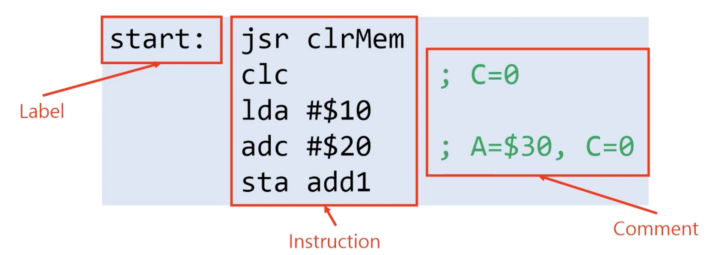

유튜브 배은태 채널의 어셈블리 언어 강의영상 내맘대로 정리

# 01.컴퓨터구조 기초

### 용어
- 논리 게이트: AND, OR, NOT..
- 조합회로: 입출력을 가진 논리 게이트의 집합, adder, mux, dmux...
- 순차회로: 출력이 입력에 의해서만 결정되지 않고 기존에 들어왔던 입력들의 영향을 받는 논리 회로, 라쳇, 플립플롭...
	- 라쳇과 플립플롭은 비동기 동기의 차이(플립플롭은 clock에 동기화됨)
	- 플립플롭은 레지스터, SRAM구현에 이용됨
		- 레지스터: CPU내부에서 연산의 중간 결과를 저장하거나 목적에 따라 다양한 종류의 데이터를 저장하는데 사용됨. CPU내부에 존재하기때문에 접근 속도가 가장 빠른 장점을 가지고 있는다 크기가 작고 비용이 비싸다
- 메모리: 데이터의 입출력 기능을 가지고 있는 기억소자들의 집합
	- 대부분의 상용 메모리들은 바이트 단위로 존재하며, 각 바이트에 접근하기 위해 주소(address)를 사용한다.
	- 주기억장치는 크게 RAM과 ROM으로 나뉘어진다.
		- RAM소자는 하드웨어 기술에 따라 다시 SRAM(static-, 콘덴서로 구성), DRAM(Dynamic-, 플립플롭으로 구성) 분류된다
	- 캐시(cache) 메모리: 지역성(locality) 개념 사용. CPU와 메인 메모리 사이(보통 CPU내부)
- 버스: 데이터들의 이동 통로
	- 각각의 레지스터들이 독립적이지 않은 공통의 버스를 사용한다.
	- CPU, I/O장치, 메모리는 **시스템 버스(System bus)** 로 연결되어 데이터를 주고받음.
	- 시스템 버스의 구성
		- 주소(address) 버스: CPU에서 주변장치들로 주소를 실어 나름
		- 데이터(data) 버스: CPU, 메모리, 입출력 장치 간에 데이터를 주고 받는 양방향 버스선
		- 제어(control) 버스: CPU나 주변장치로부터 발생하는 제어 신호를 실어 나르는 버스선

### CPU 중앙처리장치
#### 구성 요소
- __레지스터 집합(Register Set)__
- __산술논리장치(ALU, Arithmetic Logic Unit)__
- __버스 인터페이스(BIU, Bus Interface Unit)__
- __제어 장치(CU, Control Unit)__

#### 레지스터 집합
- 메모리 또는 입출력 장치에서 불러운 값이나 프로세서에서의 연산 중간 결과값들을 저장하는 고속의 저장장치
- __범용 레지스터(General Purpose Register)__: 프로그래머가 임의로 사용할 수 있는 레지스터
- __특수 목적 레지스터(Special Purpose Register)__: 프로세서나 시스템에서 특수한 목적을 위해 사용하는 레지스터
	- 누산기(AC, Accumulator): ALU에서의 연산 결과값 저장
	- 스택 포인터(SP, Stack Pointer): 메모리 스택의 Top 주소 저장
	- 프로그램 카운터(PC, Program Counter): 다음에 실행될 명령어의 주소 저장
	- 프로세서 상태 레지스터(Processor Status Register): ALU에서의 연산 결과를 반영하거나 프로세서의 각종 상태들을 저장하는 레지스터
	- 명령어 레지스터(IR, Instruction Register): 메모리로부터 읽어 들인 명령어를 저장
	- 메모리 주소 레지스터(MAR, Memory Address Register)
	- 메모리 버퍼 레지스터(MBR, Memory Buffer Register)

#### ALU와 상태 레지스터

- ALU는 산술 및 논리 연산을 수행하는 조합 회로(Reminds me NandToTetris...)
- 일반적으로 누산기 레지스터에 연산 결과가 저장됨
- 연산 결과를 반영하는 여러 상태 값들은 상태 레지스터 또는 플래그 레지스터에 저장된다.
> 대부분의 경우 상태 레지스터와 플래그 레지스터를 같은 개념으로 이해해도 큰 문제는 없습니다.
 그러나 특정 상황에서 상태 레지스터가 플래그 외에도 다른 정보를 포함할 수 있다는 점을 염두에 두어야 합니다.
 플래그 레지스터는 상태 레지스터의 하위 집합으로 볼 수 있습니다.
---
#### 명령어 실행 사이클
1. __인출(Fetch)__: 명령어를 메모리로부터 가져온다.
2. __해독(Decode)__: 명령어를 해독한다.
3. __실행(Execute)__: 해독된 명령어를 실행한다.
4. +) 간접 사이클, 인터럽트 사이클
---
#### 폰 노이만 구조와 하버드 구조

- __폰 노이만 구조__: 프로그램과 데이터를 하나의 메모리에 저장하는 구조
	- 프로그램(코드) 메모리와 데이터 메모리가 구분돼 있지 않다.
	- 프로세서와 메모리 사이에 하나의 버스를 가지고 있음
- __하버드 구조__: 프로그램 메모리와 데이터 메모리가 분리되어 있는 구조
	- 명령용 버스와 데이터용 버스가 물리적으로 분리되어 있음
	- 명령어를 읽는 것과 데이터를 읽는 것을 동시에 수행할 수 있음

# 02.명령어

### 구성요소
- 연산코드와 피연산자
	- 연산코드(Operation Code, Opcode): CPU가 수행할 동작을 나타내는 코드
	- 피연산자(Operand): 연산의 대상이고, 주로 레지스터나 메모리상의 데이터가 그 대상인 된다.
- 명령어 코드의 형식
	- 연산 코드(Opcode)
	- 주소 필드(Address)
	- 모드 필드(피연산자의 유효 주소가 결정되는 방법을 나타냄)
- 어셈블리어 코드의 형식

- 의사 명령어(Pseudo Instruction)
	- 어셈블러 디렉티브(Assembler Directive)라고도 불리고, 기계 명령어가 아닌, 번역 과정에서 발생되는 어떤 상황에 관한 정보를 어셈블러에게 알려주는 명령어
	- 어셈블리어 코드와 달리 기계 코드로 번역되지 않음
	- 어셈블러 구현체에 종속적
- 주소지정방식(Addressing mode): CPU설계에 따라 피연산자를 지정하기 위한 다양한 어드레싱 기법을 제공한다
	- 포인터, 카운터 인덱싱, 프로그램 재배치 등의 편의를 프로그래머에게 제공
	- 명령어의 주소 필드의 비트 수를 줄인다.
	- 유효주소(Effective Address): 주소지정방식에 의해 결정되는 피연산자의 실제 주소
